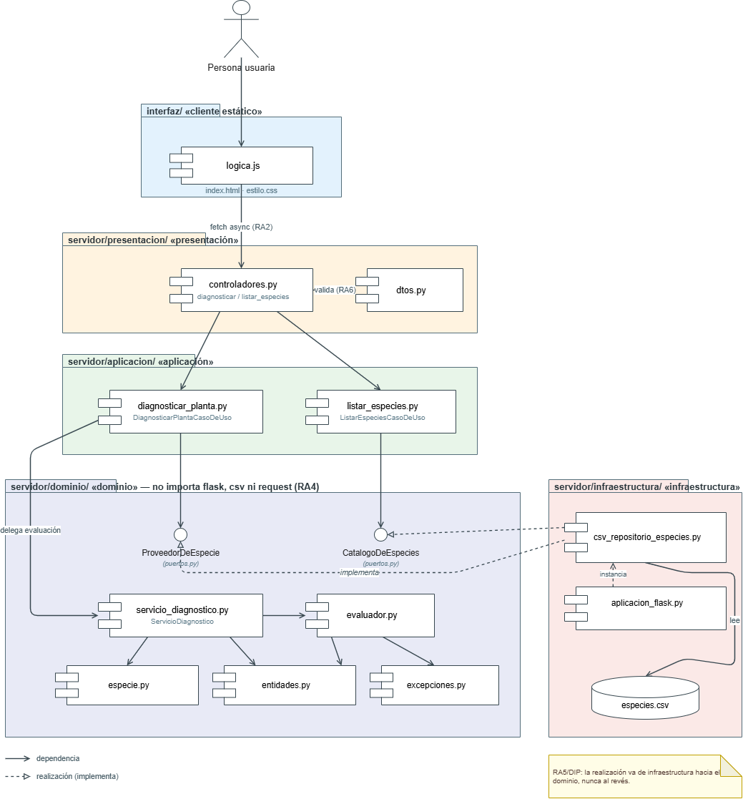
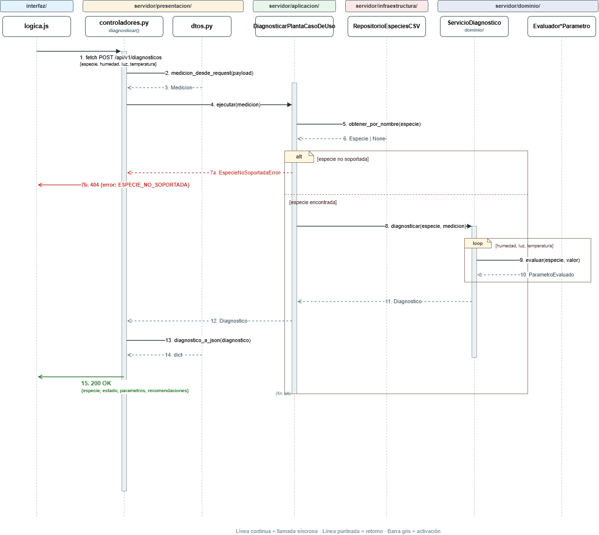

# Documento de Arquitectura — Diagnóstico de Plantas

> Este documento parte de un análisis del código real del repositorio
> hecho junto con un asistente de IA (ver bitácora). Las decisiones y
> los matices están redactados por el equipo, no copiados del
> enunciado — cada uno debería poder explicarse en la sustentación sin
> leer el documento.

## 1. Diagrama de paquetes / componentes

Corresponde 1:1 con `servidor/`. Notación UML de componentes: las
interfaces (`ProveedorDeEspecie`, `CatalogoDeEspecies`) se muestran
como círculo de interfaz; las flechas discontinuas con triángulo
hueco son *realización* (implementa); las flechas continuas son
*dependencia* (usa).

Flecha clave para RA5: `csv_repositorio_especies.py` **implementa**
los puertos declarados en `dominio/puertos.py` — la dependencia va de
infraestructura hacia dominio, nunca al revés. `dominio/` no importa
nada de `infraestructura/`, `presentacion/` ni `aplicacion/`.

## 2. Diagrama de secuencia — `POST /api/v1/diagnosticos`

Recorrido completo de una petición: valida y convierte el payload a
`Medicion` (`dtos.py`), el caso de uso resuelve la especie contra el
repositorio, y si existe delega la evaluación al dominio. Los dos
caminos del `alt` corresponden a los dos códigos de RF6: 404 si la
especie no existe, 200 con el diagnóstico si sí.

## 3. Tabla de responsabilidades por capa

| Capa | Qué hace | Qué tiene prohibido | De qué depende |
|---|---|---|---|
| **Presentación** (`presentacion/`) | Recibe el JSON, lo valida y transforma en objetos de dominio (`dtos.py`), llama al caso de uso, traduce el resultado o la excepción a una respuesta HTTP (`controladores.py`). | Calcular estados, rangos o recomendaciones. Conocer el CSV. | `aplicacion/`, `dominio/` (tipos y excepciones) |
| **Aplicación** (`aplicacion/`) | Orquesta: resuelve la especie a través del puerto y delega la evaluación al servicio de dominio. | Conocer Flask, `request`, JSON, CSV/SQL. | `dominio/` (puertos, servicio, entidades) |
| **Dominio** (`dominio/`) | Reglas de negocio: clasificar un valor, agregar el estado global, generar recomendaciones. Declara los puertos que necesita. | Importar `flask`, `csv`, `os`, o cualquier framework/mecanismo de persistencia. | Nada externo — solo `dataclasses`, `enum`, `abc`, `typing`. |
| **Infraestructura** (`infraestructura/`) | Implementa los puertos del dominio contra el CSV. Configura Flask y CORS. Es el composition root. | Contener reglas de negocio. | `dominio/`, `flask`, `flask_cors`, `csv`, `aplicacion/` |

## 4. Justificación SOLID (con archivo y línea)

**SRP** — `dominio/evaluador.py`: `ClasificadorDeRango` (línea 11)
solo compara un número contra un rango; `EvaluadorHumedad` (línea
30), `EvaluadorLuz` (línea 36) y `EvaluadorTemperatura` (línea 42)
solo arman el `ParametroEvaluado` de su propio factor;
`EvaluadorDeEstadoGlobal` (línea 48) solo agrega; `GeneradorDeRecomendaciones`
(línea 72) solo redacta texto. Si no estuvieran separadas, cambiar la
regla de agregación habría obligado a tocar la misma clase que
clasifica, y una prueba de una no se podría aislar de la otra.

**OCP** — mismo archivo, interfaz `IEvaluadorDeParametro` (línea 24)
con tres implementaciones. Agregar un cuarto parámetro (pH) es
escribir una clase nueva que la implemente; ninguna de las tres
existentes se toca.

**LSP** — `dominio/servicio_diagnostico.py`, constructor (línea
14-18): recibe los tres evaluadores tipados como
`IEvaluadorDeParametro`. Cualquier implementación de esa interfaz es
sustituible por otra sin que `ServicioDiagnostico` note la diferencia.

**ISP** — `dominio/puertos.py`: `ProveedorDeEspecie` (línea 18, un
solo método, línea 20) y `CatalogoDeEspecies` (línea 25, un solo
método, línea 27) son interfaces separadas en vez de una sola con
todo. `DiagnosticarPlantaCasoDeUso` solo depende de la primera.
*(Tensión reconocida: `RepositorioEspeciesCSV`, línea 12 de
`csv_repositorio_especies.py`, sí implementa ambas a la vez —
elegimos esto porque una sola fuente de datos cumple los dos roles y
separar la implementación habría sido sobre-ingeniería para el
tamaño actual del proyecto.)*

**DIP** — `aplicacion/diagnosticar_planta.py`, línea 6, importa
`ProveedorDeEspecie` (la abstracción), no `RepositorioEspeciesCSV`.
La implementación concreta solo se conecta en
`infraestructura/aplicacion_flask.py`, línea 30. Si mañana se cambia
el CSV por una base de datos, esa es la única línea del repositorio
que cambia.

## 5. Plan de evolución

| Escenario | Se agrega | Se modifica | No se toca |
|---|---|---|---|
| **Mediciones por MQTT (ESP32)** en vez de HTTP | Un módulo en `infraestructura/` que suscribe un tópico, arma una `Medicion` y llama a `DiagnosticarPlantaCasoDeUso.ejecutar(...)`, igual que hace `controladores.py` hoy. | Posiblemente `dtos.py`, si el payload MQTT trae campos distintos. | `dominio/` y `aplicacion/` completos: no saben si quien los llamó fue una ruta Flask o un callback MQTT. |
| **CSV → base de datos relacional** | Una clase nueva en `infraestructura/` que implemente los mismos dos puertos contra SQL. | Una línea en `aplicacion_flask.py` (la que instancia `RepositorioEspeciesCSV`). | `dominio/puertos.py`, `dominio/evaluador.py`, `aplicacion/`, `presentacion/`. |
| **Aparecen usuarios con varias plantas** | Un agregado de dominio `Usuario`/`PlantaDelUsuario`, su propio puerto, y casos de uso nuevos que *usan* `DiagnosticarPlantaCasoDeUso` en vez de reemplazarlo. | Rutas de presentación para asociar un diagnóstico a una planta/usuario. | `ServicioDiagnostico` y los evaluadores: el diagnóstico de una medición no depende de quién es el dueño de la planta. |
| **Gamificación** | Un módulo de dominio propio que reaccione a los `Diagnostico` producidos (sumar puntos si `SALUDABLE`), integrado en `aplicacion/` como paso posterior a `DiagnosticarPlantaCasoDeUso`. | El composition root, para conectarlo. | `dominio/evaluador.py` y `dominio/servicio_diagnostico.py`: premiar comportamiento en el tiempo es una regla distinta a clasificar una medición puntual. |

## 6. Decisiones y alternativas descartadas

1. **Regla de agregación del estado global** (`EvaluadorDeEstadoGlobal`,
   `dominio/evaluador.py` línea 48): contar parámetros fuera de rango
   (0 → SALUDABLE, 1 → EN_RIESGO, 2+ → CRITICO). Se consideró ponderar
   cada parámetro distinto (humedad más que luz), pero con solo 3
   parámetros y sin datos históricos una ponderación sería arbitraria
   y difícil de defender.

2. **Dos puertos separados en vez de uno solo** (`dominio/puertos.py`).
   Se consideró una única interfaz `RepositorioEspecies` con ambos
   métodos. Se descartó porque `DiagnosticarPlantaCasoDeUso` no
   necesita listar todas las especies, solo obtener una — el costo es
   que `RepositorioEspeciesCSV` termina implementando dos interfaces.

3. **Validación de rangos físicos en `presentacion/dtos.py`, no en el
   dominio.** Se consideró que `Medicion` se validara a sí misma. Se
   descartó porque "físicamente posible" (ej. -40°C a 80°C) es una
   restricción de lo que un sensor puede reportar, no una regla de
   negocio sobre plantas — quedó como validación de entrada (RA6).

4. **Convertir el dataset de especies fuera de la aplicación**
   (`utilidades/preparar_especies_csv.py`), en vez de que
   `RepositorioEspeciesCSV` lo hiciera en tiempo de ejecución. Se
   descartó leer el dataset crudo en cada arranque porque esa
   conversión es una decisión de preparación de datos, no algo que
   deba correr en producción — así `especies.csv` queda como el único
   dato que la infraestructura necesita leer.
